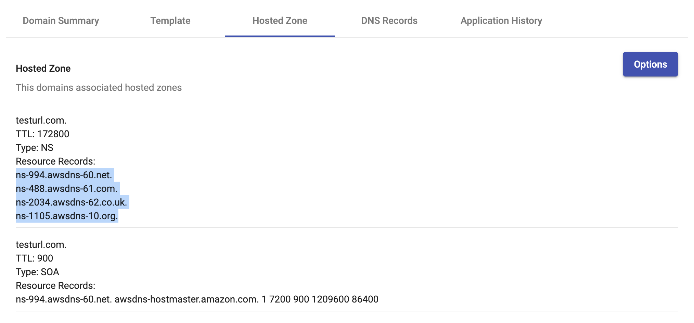

# Setup a Domain, Launch, and Categorize a Website #

1. If you haven't already, purchase your domain at a registrar
    (i.e. NameCheap, GoDaddy, etc)
2. Login to Domain Management and click on `Domains` on the left
3. For Admins, Click on `Add New Domain` button on the top right
    and type in the domain you've purchased

    

    - This will create a hosted zone for your domain so that Domain
        Management can manage your domain's DNS records and content.
    - For user roles
        - __Search__ for the domain you'd like to setup and launch.
        - If the domain doesn't exist, reach out to an admin to create the
            domain for you.

4. Once your domain has been created, click on your domain and then click
   the `Hosted Zone` tab

    

    - You'll find four nameservers (NS) similar to the ones highlighted in
      the picture above.
    - Copy these nameservers, without the `.` period at the end of each line,
      and paste them into your registrar under your purchased domain.

5. Upload content

    

    - As shown above, there are two ways to upload content for your website,
      you can upload your own web content in a zip file or select from a list of
      existing templates.
        - Note: for your own custom web content, there homepage html file must
          be named `home.html`
    - Once you have successfully upload web content, you'll be able to launch
      your website.
6. Launch website

    

    - Click on the options button
    - In the dropdown, click `Launch Site`
    - This process may take up to a few minutes until your website is live.

7. Categorize live website

    

    - In your domain details page, click `Proxy Category` tab.
    - There's a dropdown of Categories to choose from, choose the category that
      closely relates to your website content and click `Submit`
    - If you encounter any errors when attempting to categorize your website, you
      can also manually submit categorizations yourself by clicking the available
      proxy buttons. These buttons will redirect you to the proxy's categorization
      page where you can fill out the forms manually.
    - In most cases, websites will categorized within hours. However, keep in mind
      it might take up to a couple days before they get categorized for each proxy.
