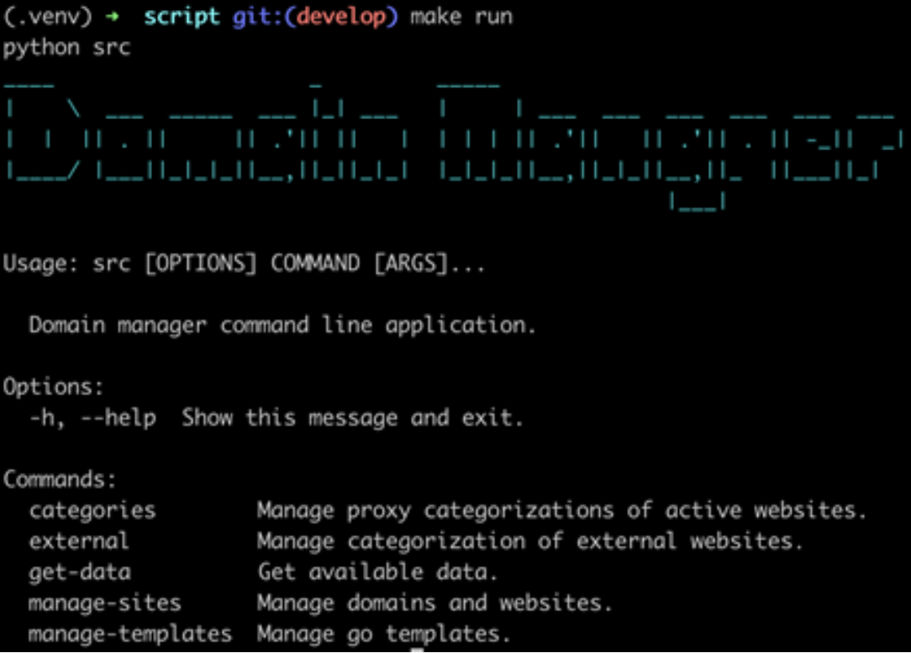
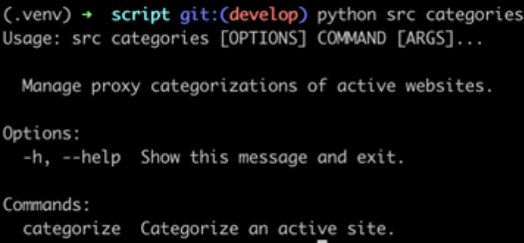
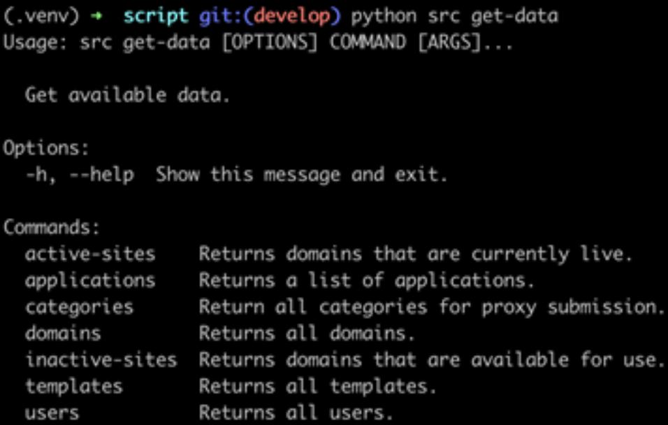
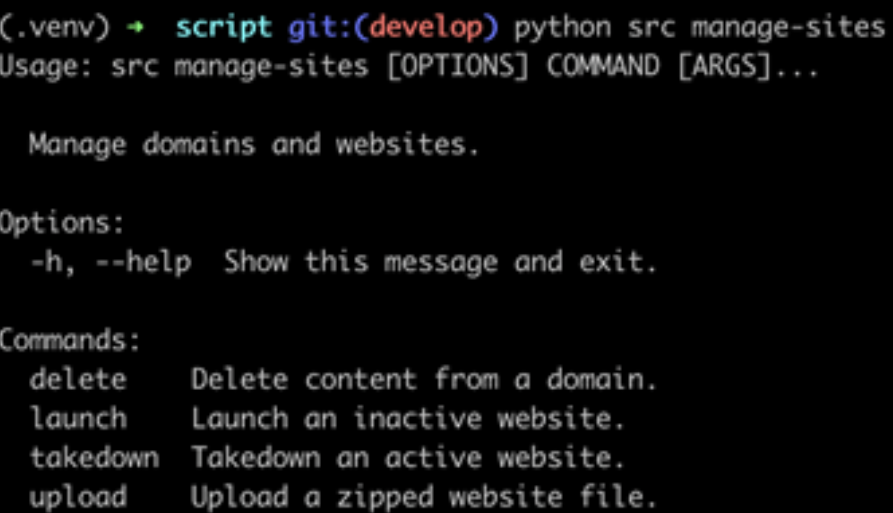
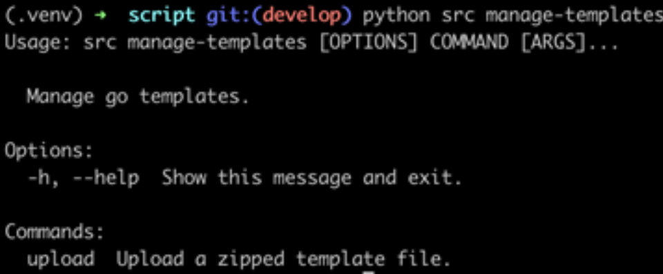

# Command Line Interface #

## Requirements ##

The following is a list of prerequisites to run the command line application. You
may have to reach out to a Domain Management Developer for some of these requirements:

- Python 3.8
- A virtual environment
  - We recommend using the built-in python tool:
    - `python3 -m venv .venv`
- Domain Management API URL
- Your Domain Management user's API key

## Setup ##

1. Clone the repo to your local environment
    - `git clone https://github.com/cisagov/domain-manager-script`
2. Install and activate your virtual environment in the root folder of the project
    - `python3 -m venv .venv`
    - `source .venv/bin/activate`
3. Install package requirements
    - `pip install -r requirements.txt`
4. Generate and copy your user API key
    - See the `User Roles` portion of this documentation
5. Create a .env file in your root directory
    - `cp etc/env.dist .env`
6. Update the variables in the newly generated `.env` file with the Domain Management
   API URL and your API key
7. Run the CLI application
    - `make run`
    - If you see the returned text below, you're ready to go!

    

## Commands ##

The following are commands within the CLI application.
You can access all commands by running this: `python src [command] [subcommand]`

There are 5 top-level commands in the CLI:

- categories
- external
- get-data
- manage-sites
- manage-templates

### Categories ###

`categories` has a single subcommand called "categorize". "Categorize" allows
you to categorize existing websites that are currently live in the domain
management. It requires a single argument, `-d` or `–domain` and the domain
name you wish to categorize. You’ll be prompted for adding a category you wish
to categorize the site with. Make sure the category is an existing category
supported by Domain Management.

### External ###

External contains two subcommands: categorize and check. These allow you to
categorize and check a website’s category that are NOT managed by the Domain
Management.

### Get data ###

`get-data` contains multiple subcommands that allow you to return data from
the domain management database. You can get information on active websites
launched from domain management, applications, categories available for use
when categorizing websites, list of all domains managed by the domain
management, inactive websites, available templates, and a list of users.

### Manage Sites ###

`manage-sites` contain multiple subcommands that allow you to launch and
manage a website. You can launch an inactive site, upload a zipped website
file, takedown an active site and delete the content completely from the
domain. In order to upload website content, you must place your zipped
file at this location: `src/uploads/`

### Manage Templates ###

`manage-templates` allow you to upload a GO template compatible for use
in Domain Management. In order to upload a template content, you must
place your zipped file at this location: src/uploads

