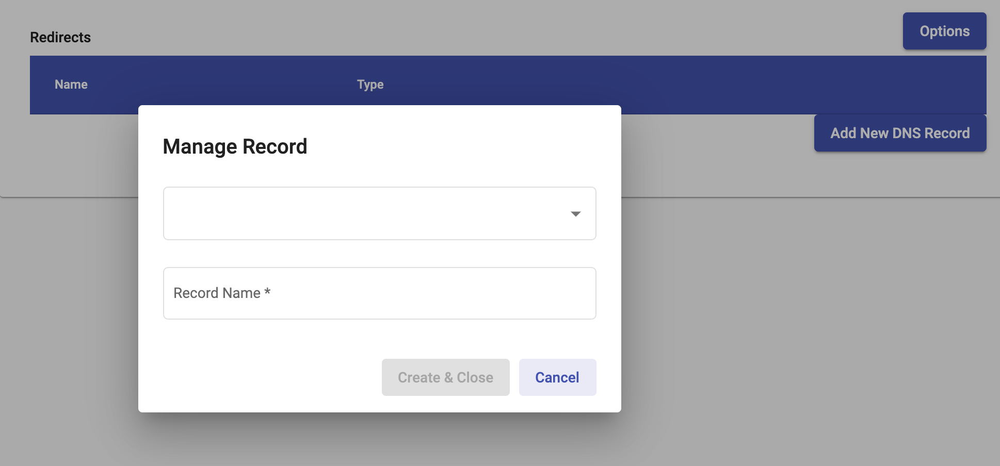

# Set up a Domain with Email Records #

A user can utilize Domain Management to setup a domain for sending emails.

1. If you haven't already, purchase your domain at a registrar (i.e.
   NameCheap, GoDaddy, etc)
2. Login to Domain Management and click on `Domains` on the left
3. Click on `Add New Domain` button on the top right and type in the
   domain you've purchased

   

   - This will create a hosted zone for your domain so that Domain
     Management can manage your domain's DNS records and content.

4. Once your domain has been created, click on your domain and then
   click the `Hosted Zone` tab

   

   - You'll find four nameservers (NS) similar to the ones highlighted
     in the picture above.
   - Copy these nameservers, without the `.` period at the end of each
     line, and paste them into your registrar under your purchased domain.

5. You can now manage DNS records for the domain under the `DNS Records` tab

   

   - You can add Email records that can be used in conjunction with
     other applications.

6. You will have to create redirects to the Landing Page Url.
   - gp.pr.somedomain.net -> con-pca.cool.cyber.dhs.gov
