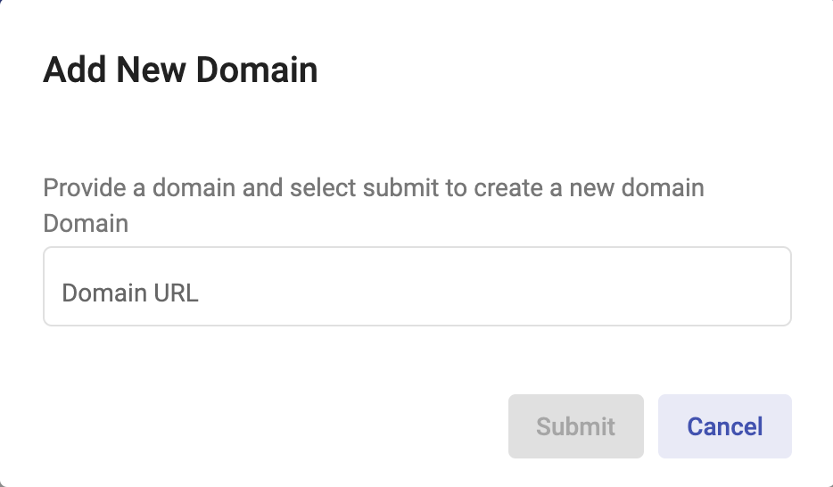
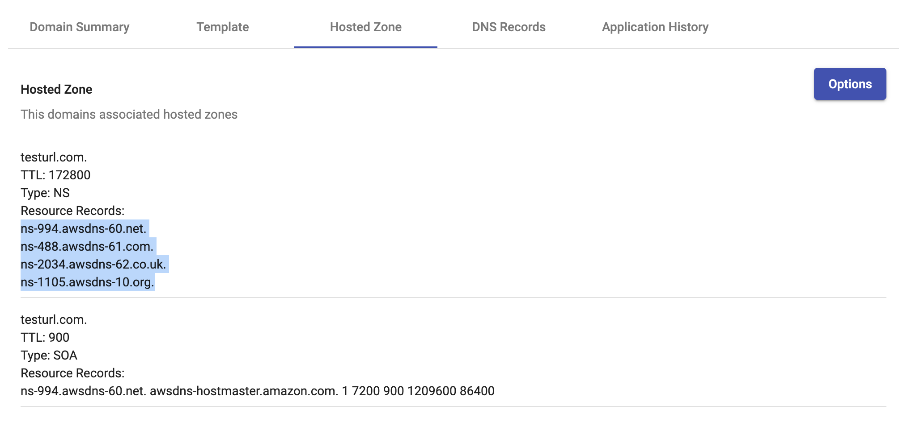
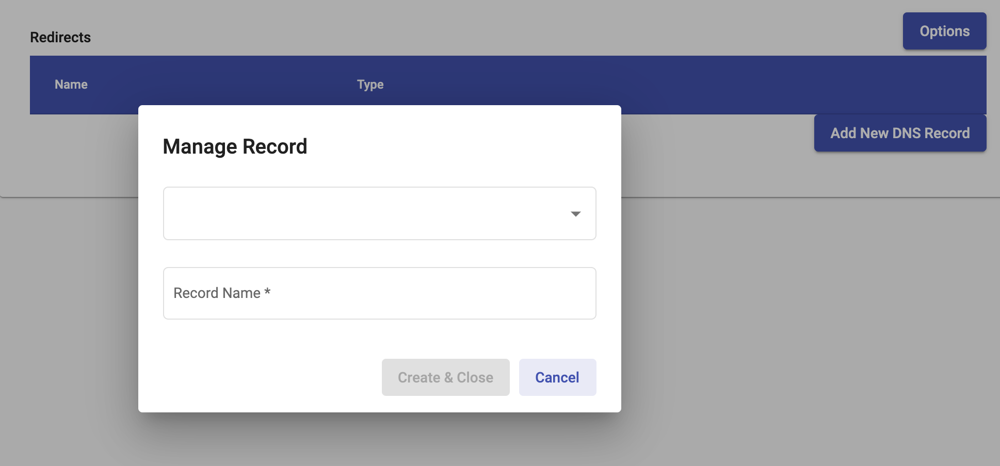
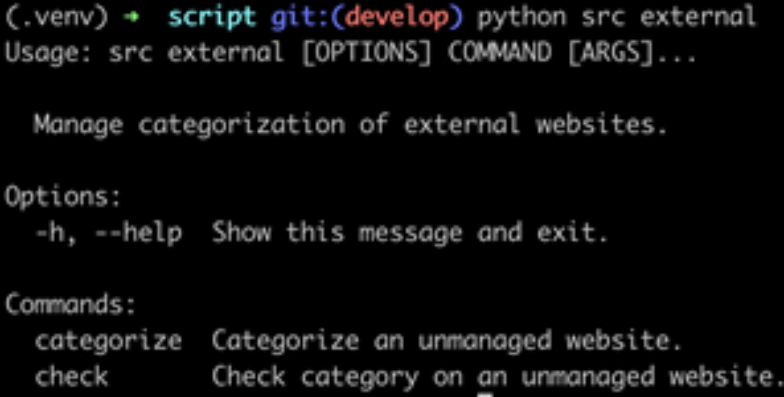

# Manage External Websites #

Domain Management can submit categories and allow management of DNS
records for websites with content setup externally, independant of
Domain Manager.

## DNS Records ##

Here are the steps for users interested in having DNS records controlled
Domain Management

1. Once the user is logged in, click on `Domains`
2. Click `Create Domain` button in the top right

    

3. Once your domain has been created, click on your domain and then click
   the `Hosted Zone` tab

    

    - You'll find four nameservers (NS) similar to the ones highlighted in
      the picture above.
    - Copy these nameservers, without the `.` period at the end of each line,
      and paste them into your registrar under your purchased domain.
4. The user can now manage DNS records for the domain under the `DNS Records`
   tab

    

## Categorization ##

Currently, a user can have external sites submitted for categorization and
categories checked using the CLI interface application. Please refer to the
Command Line section of this documentation for more information.

When the CLI application is setup and ready to go, you can run the following
commands:

- Submit an external website for categorization
  - `python src external categorize -d <domain-name>`

- Check an external website's categorization
  - `python src external check -d <domain-name>`
