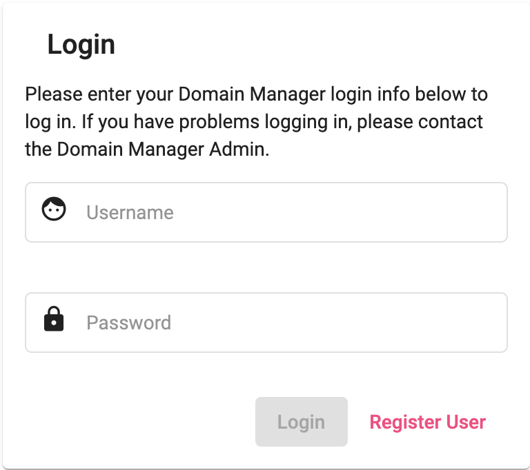
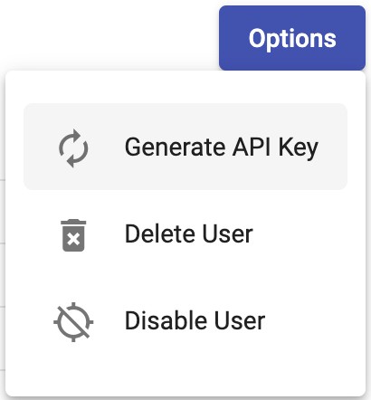

# Domain Management

The Domain Management application has several use cases. A user can:
- setup a domain
- upload templates
- choose from a selection of existing templates
- upload external web content
- launch and takedown websites
- categorize live websites on various categorization proxies
- manage DNS and Redirect records.
- categorize websites that are not managed by domain management

These functionalities can be done via a browser or the command line interface. Step by step instructions on each use case is detailed below.

## User Roles

There are two user roles in the application:
- Admin
    - This role has access to all functionalities, including all capabilities for the User role.
    - Admins can create and delete domains, applications, templates, content, and other users.
- User
    - This role has a much more limited access
    - Users can upload and download website and template content
    - Manage DNS and Redirect records
    - They can also launch and categorize websites.

Access via the browser:
1. Login to the Domain Management
    - If you don't have an account, click `Register User` and an admin will approve your account and set your user role accordingly.

    

Access via the Command line Interface (CLI):
1. Login to the Domain Management
    - If you don't have an account, click `Register User` and an admin will approve your account
2. Click the cog on the top right
    - In the dropdown, click on `My Profile`

    

3. Click ont he `Options` button
    - In the dropdown, click on `Generate API Key`

    

4. Save your generated API Key as you'll need it to use the CLI

## Use Cases

### [Case 1: Setup, Launch and Categorize a Website](1-launch-and-categorize.md)

### [Case 2: Command Line Interface](2-cli.md)

### [Case 3: Setting up Email Records](3-email-records.md)

### [Case 4: Categorize External Websites](4-external.md)